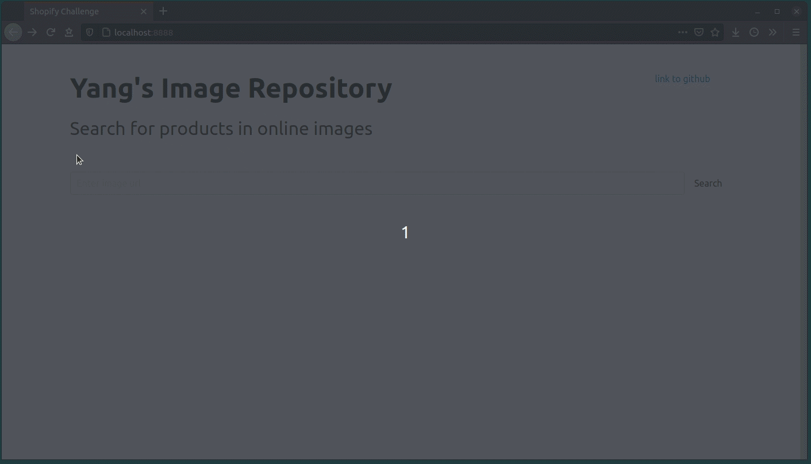

# Image Repository
This is for Shopify Developer Intern Challenge Question, Fall 2021.  
The image repository allows for searching for similar images of the same product. For example, an image of a blender and a toaster would return images of blenders and toasters in the product inventory. This is done by [keywording](https://labs.everypixel.com/api/demo) the input image.

## Getting Started
### Prerequisites
This Image Repository uses python [Tornado](https://www.tornadoweb.org/en/stable/) as the webserver and [pytest](https://docs.pytest.org/en/6.2.x/) for unit testing. To install the two modules:
```
pip install tornado pytest
```
### How to use it
After cloning this git repo, run
```
python3 server.py
```
will start the server at localhost:8888

## Run test
To run the existing tests, simply do
```
pytest -v
```

## Usage Example
Using this [sample image](https://thumbs.dreamstime.com/b/blender-toaster-bread-20009052.jpg) of a toaster and a blender, the repostiory will return images of toasters and blenders in the product inventory.


## Future Features
* List more product information other than brand (e.g. product price and features)
* Add a "Buy" link at the bottom of each image
* Provide bundle recommendations (e.g. show coffee maker when searching for toaster)